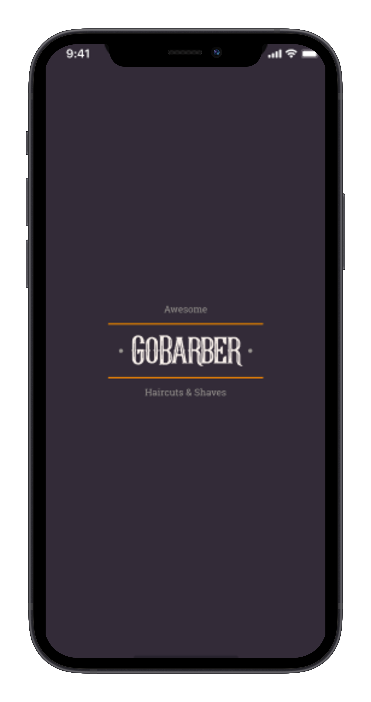
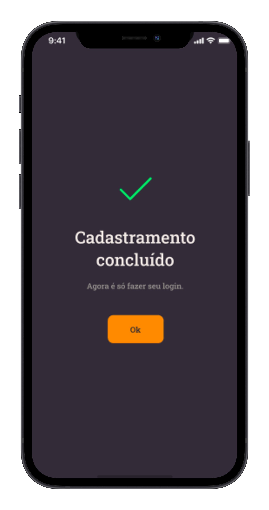

# 
<h2>App de agendamento entre cliente e prestador. [Em desenvolvimento] 🚧</h2>

<h1 align="center">
  
  
  
  
</h1>

## Execução 💻
 - Rodar os seguintes comandos:
 	- yarn install
   - yarn android
	- yarn start

## Tecnologias usadas 🛠
- React Native
- Typescript
- Styled Components

